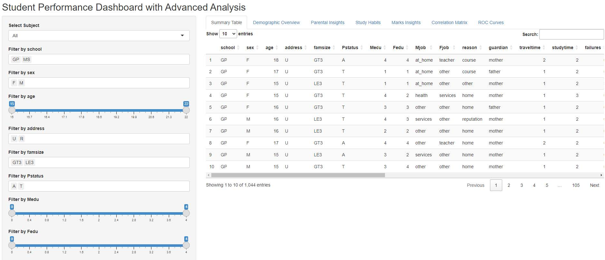
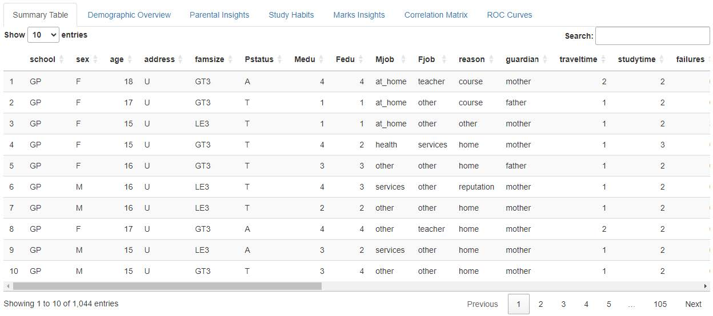
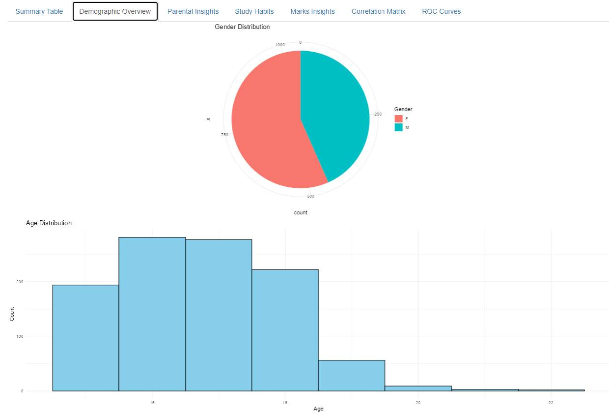
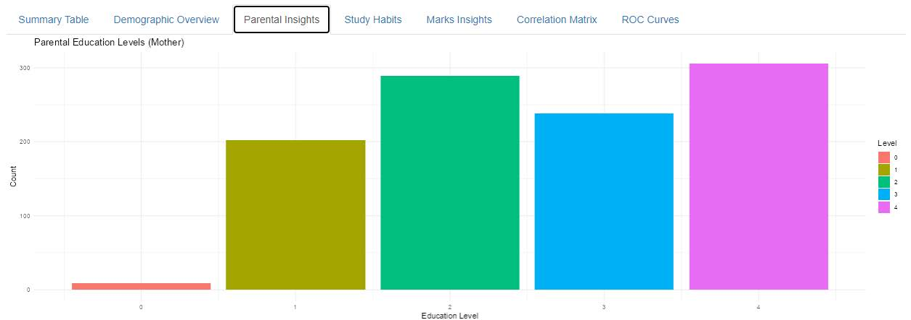
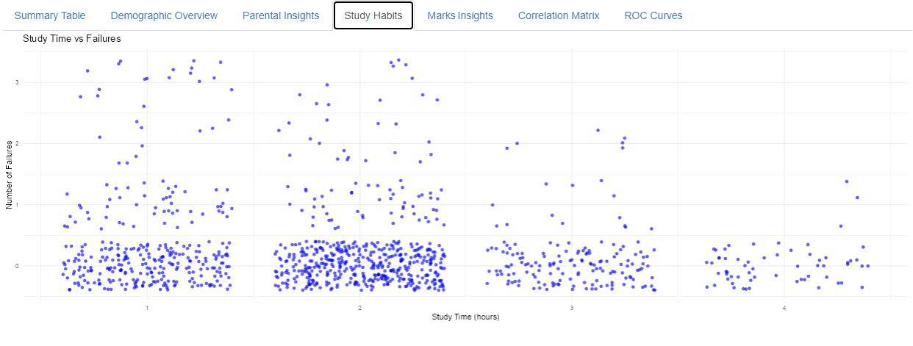
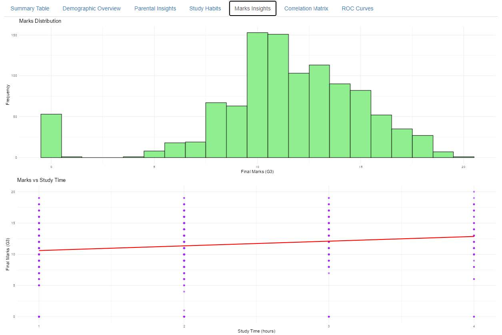
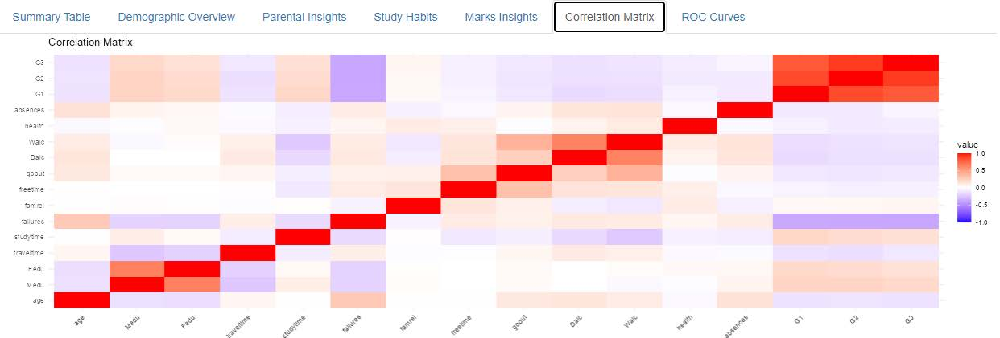
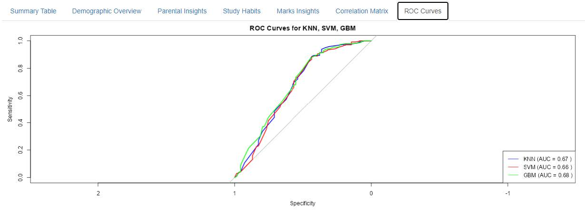

<h1>Introduction</h1>

  This dashboard is designed to help educators, administrators, and data analysts
  understand student performance trends based on demographic factors, study habits,
  and various other predictors.

<h1>Install Required R Packages</h1>

  Before running the Shiny app, you need to install the necessary R packages.
  These packages handle data, create visualisations, and build the app.
  Run the commands below in RStudio or the R console to install them:

<pre><code>
install.packages(
  c(
    "shiny",        # For building the interactive web application
    "ggplot2",      # For creating visualizations
    "dplyr",        # For data manipulation
    "plotly",       # For interactive plots (optional)
    "caret",        # For machine learning models
    "kernlab",      # For Support Vector Machines (SVM)
    "randomForest", # For Random Forest model (optional)
    "gbm",          # For Gradient Boosting Machine (GBM)
    "caTools",      # For data splitting
    "pROC"          # For ROC curve plotting
  ),
  dependencies = TRUE
)
</code></pre>

<strong>
  Note: Make sure to run “student-performance-analysis.R” to create the global environment
</strong>

<h1>UI Layout</h1>

The user interface (UI) is divided into a sidebar and a main panel.

<h2>Sidebar</h2>
<ul>
  <li>
    <strong>Select Subject:</strong> Dropdown to choose between “Math”,
    “Portuguese”, or “All subjects” for filtering the data.
  </li>
  <li>
    <strong>Dynamic Filters:</strong> Depending on the subject selected, filters
    are dynamically displayed. These include:
    <ul>
      <li>
        <strong>Numeric columns:</strong> age, study time, failures, and marks,
        with slider inputs for selecting ranges.
      </li>
      <li>
        <strong>Categorical columns:</strong> gender and parental education,
        with multi-select dropdowns.
      </li>
    </ul>
  </li>
  <li>
    <strong>Update Button:</strong> Once filters are adjusted, click
    “Update View” to refresh the data and visualizations.
  </li>
</ul>

<h2>Main Panel</h2>

This panel contains the following tabs:

<ul>
  <li><strong>Summary Table:</strong> A table of the filtered dataset.</li>
  <li><strong>Demographic Overview:</strong> Visualizations of gender, age distribution, and parental education.</li>
  <li><strong>Parental Insights:</strong> Breakdown of parental education levels and their impact.</li>
  <li><strong>Study Habits:</strong> Insights into how study time and failures influence performance.</li>
  <li><strong>Marks Insights:</strong> Distribution of marks and their relationships with study habits/failures.</li>
  <li><strong>Correlation Matrix:</strong> A heatmap showing correlations between numeric variables.</li>
  <li><strong>ROC Curves:</strong> ROC curves and model performance for KNN, SVM, and GBM models.</li>
</ul>

<h1>Detailed Explanation of Each Tab</h1>

<h2>Summary Table</h2>

<ul>
  <li>
    <strong>Content:</strong> A table showing the filtered data, with
    horizontal scrolling enabled.
  </li>
  <li>
    <strong>Interactivity:</strong> Table is interactive; filters update
    the rows displayed.
  </li>
</ul>

<h2>Demographic Overview</h2>
<ul>
  <li><strong>Gender Distribution:</strong> Pie chart of gender breakdown.</li>
  <li><strong>Age Distribution:</strong> Histogram of student ages.</li>
</ul>

<h2>Parental Insights</h2>

  <strong>Parental Education Levels:</strong> Plot of student counts by
  mother’s and father’s education, showing potential performance links.

<h2>Study Habits Insights</h2>

  <strong>Study Time vs Failures:</strong> Scatter plot of study time
  against failure count, illustrating their correlation.

<h2>Marks Insights</h2>

<ul>
  <li><strong>Marks Distribution:</strong> Histogram of final marks (G3).</li>
  <li><strong>Marks vs Study Time:</strong> Scatter plot of marks vs study time.</li>
  <li><strong>Marks vs Failures:</strong> Scatter plot of marks vs failures.</li>
</ul>

<h2>Correlation Matrix</h2>

  <strong>Heatmap:</strong> Correlation matrix for numeric variables
  (age, marks, study time, failures). Positive in red, negative in blue.

<h2>ROC Curves</h2>

  <strong>ROC for KNN, SVM, GBM:</strong> Plots with AUC values in the legend
  to compare model performance.

<em>Note: Graph generation time may vary depending on PC performance.</em>

<h1>Interactivity and User Controls</h1>

<h2>Dynamic Filters</h2>
<ul>
  <li>Slider inputs for numeric variables (age, study time, marks).</li>
  <li>Dropdowns for categorical variables (gender, parental education).</li>
</ul>

<h2>Update Button</h2>

  After changing filters, click <strong>Update View</strong> to refresh
  all data displays and visualizations.

